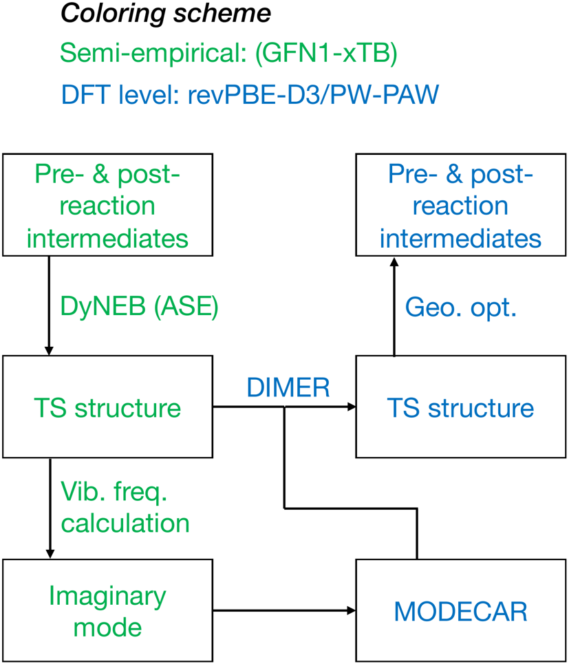

# Tools for Exploring Reaction Network of CO2 Hydrogenation into C1-2 Oxygenates

This repository is a version-of-record code deposit for the article; we do not accept pull requests. Please fork or download for your own use. The code in this repository is released under the MIT License. For bug reports, please email the authors.

This repository accompanies the article in **EES Catalysis** (Royal Society of Chemistry):

[**Reaction Network of CO2 Hydrogenation into C1-2 Oxygenates and Its BEP Relationships**](https://pubs.rsc.org/en/content/articlehtml/2026/ey/d5ey00338e)  

Mikhail V. Polynskii, Sergey M. Kozlov

The original article (DOI: 10.1039/D5EY00338E) is published under Creative Commons Attribution-Non Commercial 3.0 Unported Licence

Article abstract: Although copper is one of the most common components in catalysts for CO2 conversion into valuable C2+ chemicals, a clear and systematic mechanistic explanation of its unique properties in these processes is lacking. Herein, we address this challenge by introducing a novel ansatz to rationally construct catalytic reaction networks and account for realistic active sites on catalyst nanoparticles, applied here to CO2 hydrogenation into C1 and C2 oxygenates, explaining the formation of frequently observed reaction intermediates. We also provide a comparative mechanistic analysis of CO2 hydrogenation on a stronger-adsorbing metal widely used in hydrogenation reactions, Pd. Furthermore, we present a refined approach to Brønsted-Evans-Polanyi relationships tailored to structural characteristics of transition states. Our approach facilitates further exploration of CO2 hydrogenation on transition metal-based catalysts, deepening our understanding of the underlying reaction mechanism. This theoretical framework not only elucidates the intricate kinetics of CO2 hydrogenation but also establishes a versatile foundation for rational catalyst design across catalytic domains. This study highlights the unique activity of Cu in various hydrogenation and C–C coupling steps. Unlike scarce metals that require resource-intensive extraction, Cu reduces the environmental impact and costs of CO2 conversion technologies. Clarifying its unique role in converting CO2 into valuable C2+ chemicals moves us closer to balancing economic growth and environmental protection.

[**Schematic representation of the multistep computational workflow (article ESI)**](https://www.rsc.org/suppdata/d5/ey/d5ey00338e/d5ey00338e3.pdf)

The scripts and notebook deposited here implement the the tools used to simplify the quantum chemical calculations for the construction of the reaction network:
- The **Jupyter notebook** implements semi-empirical (GFN1-xTB) optimizations, vibrational frequency analyses on selected atoms, and staged DyNEB calculations to obtain guess transition state geometries and the associated imaginary modes.
- The **Python scripts** generate VASP input sets for geometry optimization, vibrational frequency calculations, and TS optimizations using the DIMER method; to set up a DIMER calculation, one can use a dedicated script to automatically generate a VASP `MODECAR` file from GFN1-xTB imaginary modes computed using GFN1-xTB in ASE.

## Prerequisites (Anaconda environment) to run the scripts and notebook

### Python
- Python 3.10 or newer is recommended.

### Required Python packages (conda-forge recommended!)
- `ase` [(Atomic Simulation Environment, ASE)](https://ase-lib.org/)
- `numpy`
- `matplotlib`
- `jupyterlab` (or `notebook`)
- `xtb` and `xtb-python` (provides `xtb.ase.calculator.XTB`)

Optional but useful:
- `ipykernel`
- `tqdm`

### External software and data (not distributed here)
- **VASP** (licensed) and PAW datasets (licensed).
- To write `POTCAR`, VASP PAW potentials must be available locally and discoverable by ASE (commonly via a variable such as `VASP_PP_PATH`, depending on your ASE configuration).
- A VASP build with [DIMER](https://theory.cm.utexas.edu/vtsttools/dimer.html) (requires VTST Tools).

## Windows-specific notes (likely required customizations):
- The scripts include a Unix-style hashbang line that is specific to a Linux/macOS conda path
- The notebook uses a user-specific absolute working directory (`basedir`). Update it to your local Windows path.
- VASP is most commonly run on Linux HPC systems. If you generate inputs on Windows and run VASP elsewhere, keep the directory structure consistent and verify that `POTCAR` writing works in the environment that has access to PAW potentials (often easiest on the target Linux system).
- If ASE does not find PAW potentials on Windows, configure the potential path (`VASP_PP_PATH`) according to your local ASE setup.

## What is in this repository (utility of the scripts and the notebook)

### scripts/xTB_Opt_Vib_NEB-Optimized.ipynb

Implements semi-empirical optimization of the initial and final states and transition state guess generation using ASE + xTB:
- geometry optimization at GFN1-xTB using xtb.ase.calculator.XTB
- vibrational analysis on a selected subset of atoms (adsorbate)
- DyNEB setup with staged convergence tightening and NEB profile plotting via ASE NEBTools

Default file naming conventions:
- init.xyz for optimization and vibrational analysis
- reac.xyz and prod.xyz as NEB initial and final states

Required edits before running:
- set the working directory (basedir)
- set the number of metal atoms (update to match your cluster model)
- check filenames and any placeholders in the notebook cells

### scripts/Vib2MODECAR.py
Converts an ASE vibrational mode file (for example, vib.xyz produced by ASE) into a VASP MODECAR suitable for DIMER initialization. Parses the input file, extracts eigenvector components for Mode #0 (treated as the imaginary mode), and writes MODECAR. Usage:

`python scripts/Vib2MODECAR.py vib.xyz`

### scripts/Generate_Input_DIMER_VASP.py

Generates VASP input files for Dimer refinement from an input XYZ (init.xyz by default, or a filename argument). The Dimer direction is supplied via a MODECAR (generated separately by Vib2MODECAR.py). Writes INCAR, KPOINTS, POSCAR, and POTCAR and includes Dimer-related INCAR tags (for example, ICHAIN, IOPT) consistent with the workflow used in the paper. Usage (*Place MODECAR (obtained using Vib2MODECAR.py) in the same directory before running VASP*):

`python scripts/Generate_Input_DIMER_VASP.py init.xyz`

### scripts/Generate_Input_Opt_VASP.py
Generates VASP input files for **geometry optimization** from an input XYZ (init.xyz by default, or a filename provided as an argument). Reads the structure, applies a simulation cell / centering / PBC, enforces VASP element grouping (metal atoms first), and writes INCAR, KPOINTS, POSCAR, and POTCAR via ASE. Usage:

`python scripts/Generate_Input_Opt_VASP.py init.xyz`

### scripts/Generate_Input_Vib_VASP.py
Generates VASP input files for **finite-difference vibrational calculations** (IBRION = 5) **from CONTCAR**. Constrains (fixes) all atoms of the selected metal element and writes INCAR, KPOINTS, POSCAR, and POTCAR. Usage:

`python scripts/Generate_Input_Vib_VASP.py`

